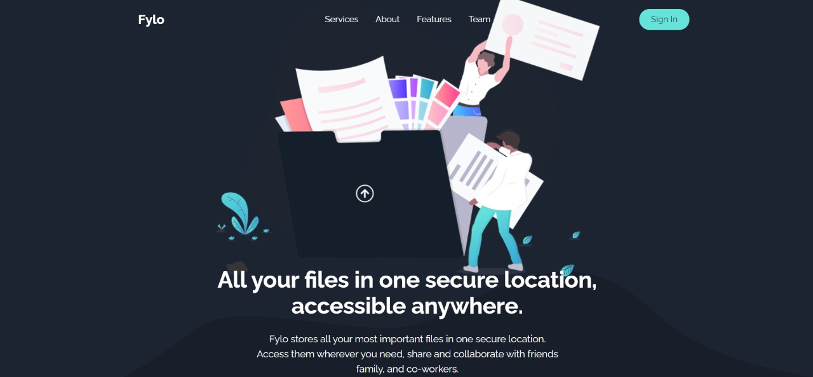
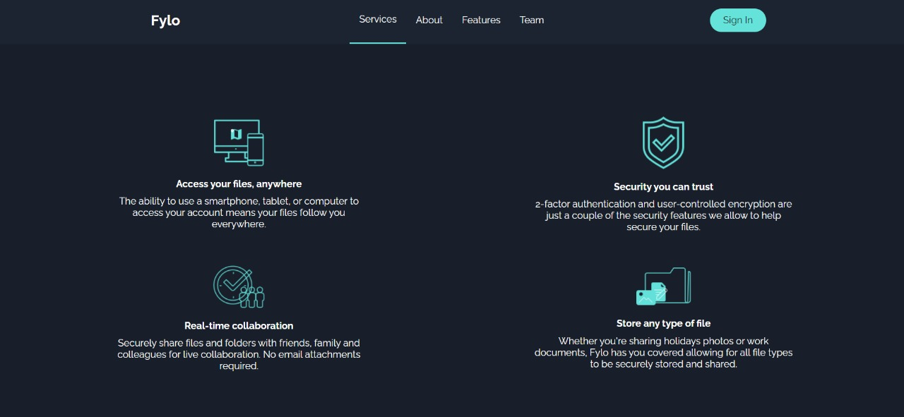
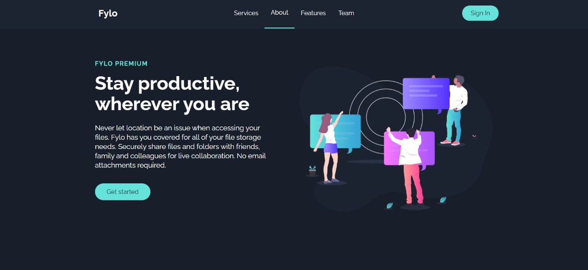
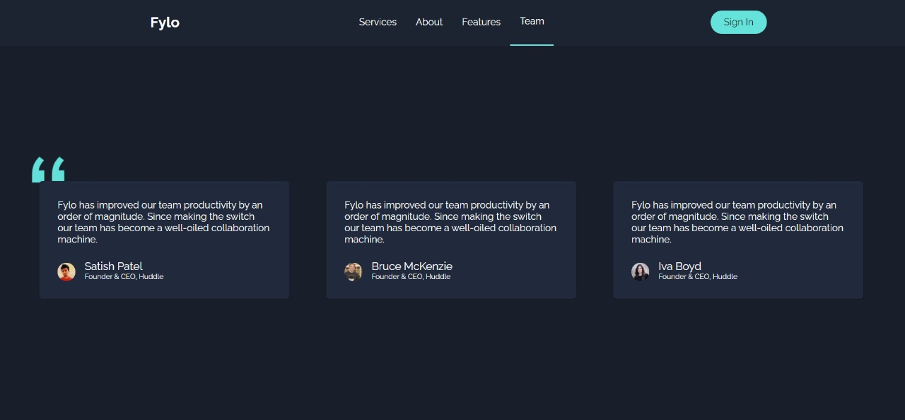
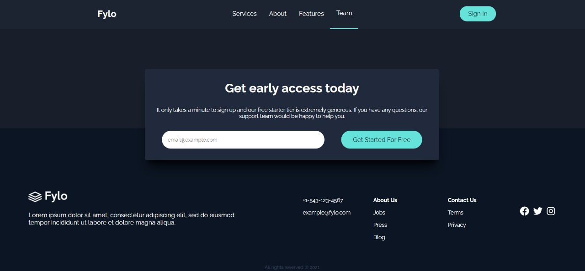

<h1 align="center">Front-End Mentor: Fylo Landing Page ✨</h1>
<p align="center">O projeto se trata de um desafio disponível no site <a href="https://www.frontendmentor.io/challenges/fylo-dark-theme-landing-page-5ca5f2d21e82137ec91a50fd" target="_blank">Front-End Mentor</a>.<br>
A ideia é desenvolver um código que se aproxime o máximo possível do design proposto no desafio.
</p>

<br>

<h2>🦄 Como foi feito?</h2>
<p>Para realização desse projeto foi usado ReactJS + SmoothScroll e Hooks como: useState e useEffect. 
<br>
Para estilização foi utilizado styled components.
</p>

<br>

<h2>💫 Tecnologias </h2>
<p>As seguintes ferramentas foram usadas na construção do projeto:</p>
<ul>
<li>🚀 React</li>
<li>💻 JavaScript</li>
<li>🎨 Styled Components</li>
</ul>

<br>

<h2>Confira a página no link abaixo:</h2>

https://frontendmentor-landing-page.netlify.app/


<br>

<h2>Caso você queira analisar o projeto em sua máquina, siga o passo a passo:</h2>

<br>

<h3>🤍 Clone o repositório:</h3>

```json
https://github.com/laoliveir/landing-page.git
```

<h3>💙 Acesse o diretório:</h3>

```json
cd <nome-do-diretorio>
```

<h3>💚 Instale as dependências:</h3>

```json
npm install
```

<h3>🧡 Inicie a aplicação: </h3>

```json
npm start
```

<h3>💛 O projeto fica na porta:</h3>

```json
http://localhost:3000/
```

<br>

<h2>📱💻 🖥️ Imagens do projeto:</h2>
<br>






<br>

<h2>👩‍💻 Autora: </h2>
<p>Feito com ❤️ por Larissa Oliveira 
<br><br>
👋 Entre em contato!
</p>

[](https://www.linkedin.com/in/laoliveir/)

[](mailto:laoliveir97@gmail.com)
